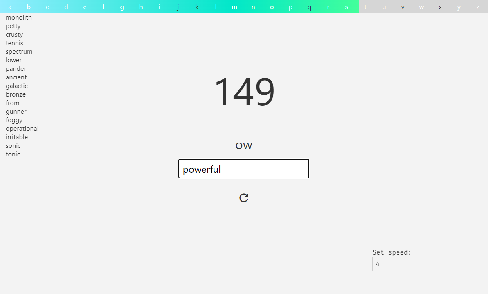

# Wordplete

### Complete words from given bigrams and trigrams as fast as you can think and type! The ngram frequency is calculated with a [python script](backend/main.py)

Helpful resources: 
http://app.aspell.net/create 
https://dictionaryapi.dev/
